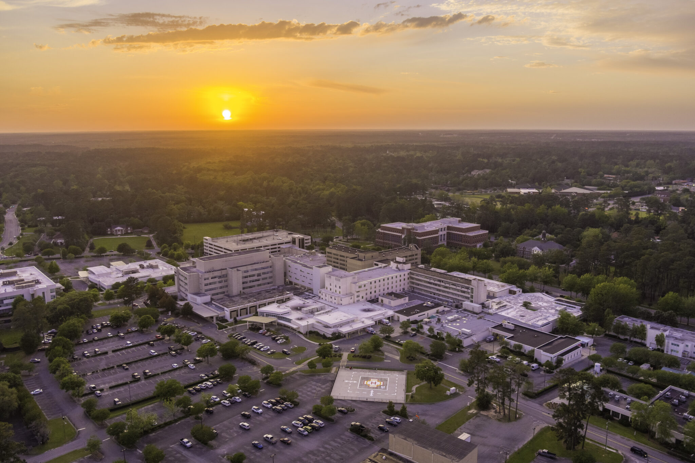

# Azalea Report

The Azalea Report is a digital newsletter designed to showcase the achievements, events, and community of the SGMC Health Internal Medicine Residency program. Our goals were to create a visually appealing, responsive design that could be easily updated by non-technical staff.

